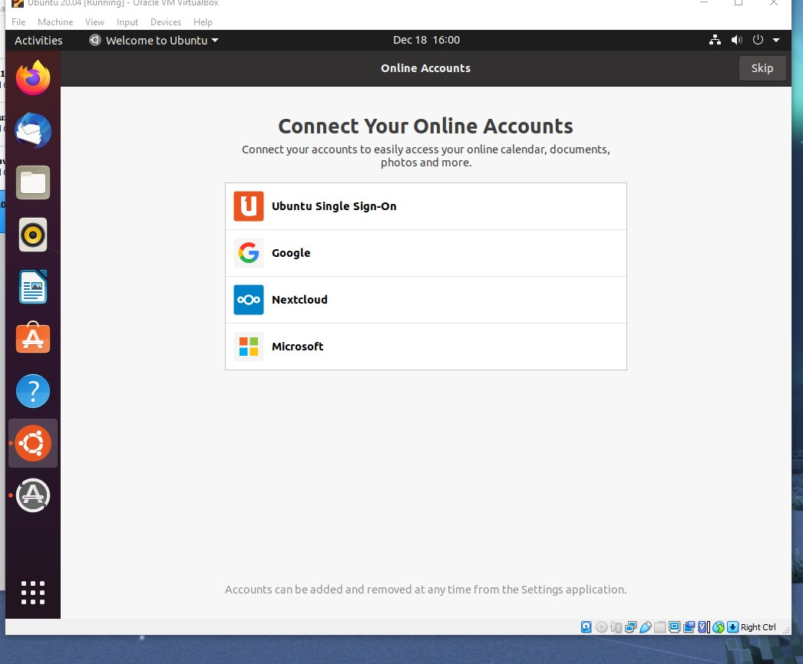
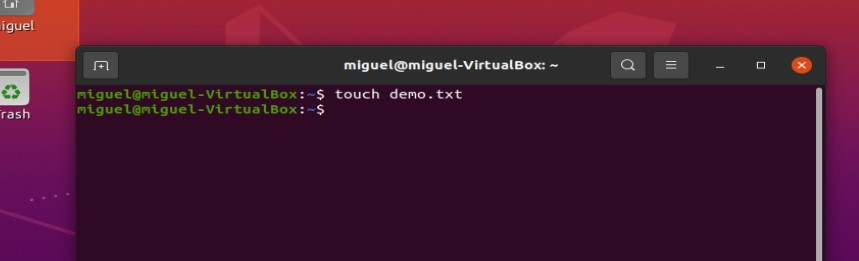
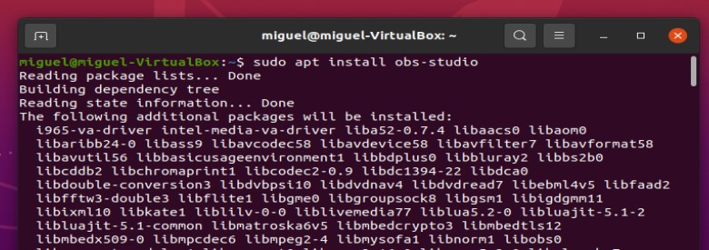

# Deliverable 3


- [Deliverable 3](#deliverable-3)
  - [Installation](#installation)
  - [Setup](#setup)
  - [Install software using the command line as well as the software center](#install-software-using-the-command-line-as-well-as-the-software-center)
  - [Basic commands](#basic-commands)
  - [Every-day-use applications](#every-day-use-applications)
  - [Entertainment](#entertainment)
  - [School work](#school-work)
  - [Help and troubleshooting tips](#help-and-troubleshooting-tips)
          - [Citations](#citations)


For this Project I will be showing a tutorial on how to install Ubuntu and giving an explanation of the basic applications and aspects of the Operating System. 

## Installation 
* The first step to entering the world of linux and installing Ubuntu inside a virtual machine.
* Inside the Ubuntu Official website there is a download option, when clicked it will begin the download for the iso file. This file serves as the installation medium to be able to install Ubuntu.
  


* Once the iso file has downloaded you can open up virtual box and begin the setup for starting up the virtual machine.


* When creating it, selecting "NEW", then name your virtual machine and select what type of OS will be used. In the is case it is an Ubuntu machine so we will select it.


* After that its a matter of allocating memory, and hard drive space.


* Make sure to set the storage to be dynamically allocated otherwise you will lose storage from your regular OS.


* After finishing this first set up we will go into settings and give the machine the processor cores required to run the machine efficiently.


* Select storage, in the IDE controller you want to add the ISO image that we downloaded from the Ubuntu website.


* From here we will start the machine and begin installing and setting up Ubuntu.


## Setup
* After starting the virtual machine you will begin the installation setup for the OS.


* You will select the "Install Ubuntu" button to continue.


* You will be given the option to select the keyboard layout as well as the language.


* There are options for installing a full package with utilities for regular use or minimal installation, this is for the most basic installation for people that want to customize the OS by themselves.


* It will also install updates if you want.


* After that its a bit more of setting up the hard drive and formatting it for the OS to work (since this is a virtual machine it will not have consequences)


* Select the time zone, and finally create a user for the OS.


* The next step is waiting until Ubuntu finishes installing and then reboot the system (virtual machine)


##  Install software using the command line as well as the software center
* After logging into the user account you will be greeted by a another small setup page, but this one is for more minor things and also gives tips for new users.



* It will also give you the ability to update your OS if you prefer.


* One of the main helpful screens is the page showing the user that they are able to install different software using the "Software" option, this is the way to install things using the GUI.


* There is a different way to install things in your system. The main way to install software in all other flavors of Linux is by using the command line.


* All applications follow similar steps when installing through the GUI or command line.


* The ``` apt search <name of application> ``` will search for as many applications with a similar name that it can find and will show them to you.


* ``` sudo apt install <name of application> ``` will install the application that you have chosen.


## Basic commands
* Ubuntu is a beginners flavor of Linux, which means that it has multiple GUI features but can also be fully controlled through the command line as well.
* There are different basic commands that can make the experience of using Linux more interesting.
  * The basic commands needed to operate are:
    * ``` pdw ``` : This command shows the current working directory.


    * ``` cd ``` : Allows you to move back and forth between directories.


    * ``` mkdir ``` :This command allows the user to make a directory.


    * ``` touch ``` :This command will allow you to create files.


    * ``` ls ``` : Allows the user to view the the inside of the current directory.


    * ``` cat ``` : Will allow you to see the the inside of a file and all of its contents.


    * ``` head ``` : Will allow the user to see the first 10 lines of a file.


    * ``` tail ``` : Will allow the user to see the last 10 lines of a file.


    * ``` mv ``` : This command allows the user to move files as well as rename them.


    * ``` cp ``` : This command will allow the user to copy a file and place it somewhere else.


    * ``` rm ``` : This command is for removing directories as well as files and by adding the -r option it will delete the directory as well as everything else inside of it.


    * ``` sudo ``` : This command will allow the user to enter the superuser permissions, they will have the same permissions as administrators.


    * ``` tree ``` : This command will show the contents of a directory but in a more organized manner.


    * ``` grep ``` : This command allows the user to search whatever given output and isolate it. It is very similar to how ```ctrl+f``` on windows. 


* There are other types of commands but they are used for more advanced functionalities within linux.
* Adding options to commands will add or remove functionalities from the output of the commands.
* One function of using the command line is that when accessing files and directories, the absolute path or relative path must be used for the system to know where the files are located.
## Every-day-use applications
* Internet Browsing.
  * The default browsing software that is added with Ubuntu is "Mozilla Firefox".
  * It is a regular web browser and there isn't anything different for it in linux.


* Reading Email.
  * Ubuntu comes with its own email software, this one is called "Thunderbird Mail"  


* Office Suite.
  * Libre Office is the Linux version of all the Microsoft Applications (Word, powerpoint, excel, etc.)


## Entertainment
* Streaming media.
  * OBS, a popular streaming and recording application can also be installed to Ubuntu.



* Playing games.
  * It is possible to install games on Ubuntu. There are a large variety of games that can be installed when searching by category.


* Chat.
  * Discord, one of the most popular chatting applications for PC users can be installed and operated regularly through Ubuntu.


## School work
* Programming.
  * The greatest tool used by many programmers can be installed in Ubuntu. VS code is a software used by many programmers to do their work. It is a very versatile application. 


* Educational Apps.
  * Ubuntu also allows for educational software to be used installed, children and regular people can use this software to learn many different topics.


* Video Calling.
  * Zoom is also available on Linux, it is the most popular video calling app as of now due to its easy to use system.


## Help and troubleshooting tips
* When trying to troubleshoot or look for help when using commands the ``` man ```  command to see all the different options that a command can do.
* Another option is looking at guides online for more complex troubleshooting.
* Finally, the ``` / ``` is the root, it is the most powerful tool in the linux arsenal, its is so powerful that it can completely destroy the OS without any hope of recovering any data. Use only if needed.


###### Citations

“The Linux Command Line for Beginners.” Ubuntu, ubuntu.com/tutorials/command-line-for-beginners#1-overview. 

Prakash, Abhishek, and About Abhishek PrakashCreator of It's FOSS. An ardent Linux user &amp; open source promoter. Huge fan of classic detective mysteries ranging from Agatha Christie and Sherlock Holmes to Detective Columbo &amp; Ellery Queen. Also a movie buff with a soft corner for. “How to Connect to WIFI from the Terminal in Ubuntu Linux.” It's FOSS, 31 Aug. 2021, itsfoss.com/connect-wifi-terminal-ubuntu/. 

Rendek, Renata. “Ubuntu 20.04 Guide.” Linux Tutorials - Learn Linux Configuration, 11 Apr. 2020, linuxconfig.org/ubuntu-20-04-guide. 