# Lab 3 | Installing software and navigating the file system | Answers
Assignment description [here](https://raw.githubusercontent.com/ra559/cis106/main/labs/lab3.md)

## Question 1
1. Which command did you use to search for the themes and to install them?
   * For searching a theme is used the "apt search theme" command
   * For the installing the theme I used "sudo apt install" command with the name of the theme
2. Which commands did you use to find and install the web browser? 
   *  For searching a theme is used the "apt search web browser" command
   *  For the installation I used "sudo apt install" and the name of the browser chosen
3. 3.1 What is the name of the package? 
   * The package is called "xwelltris" 
4. 3.2 What dependencies are needed in order to install the package? (you can either take a screenshot of the terminal or copy and paste from the terminal)

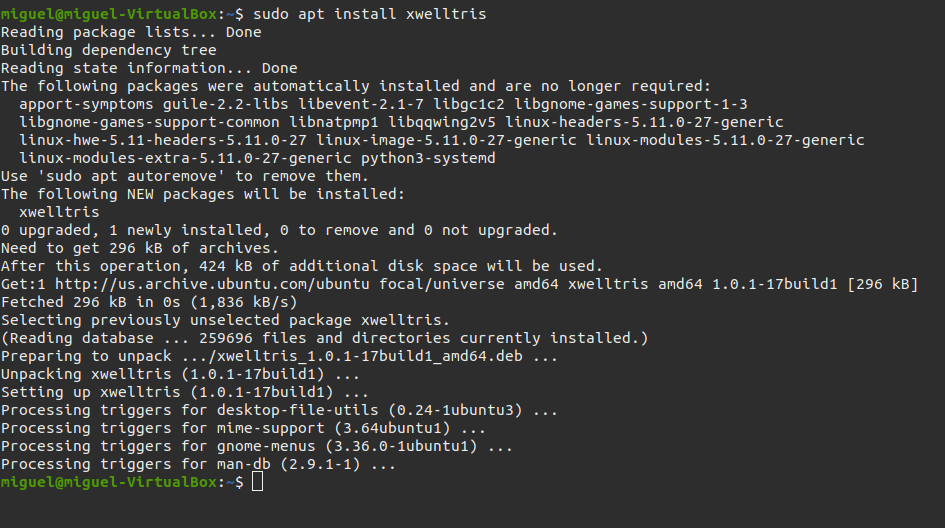

3.3 How much disk space will the package utilize after installation? 
   * The package will use 296 kb of storage
 

## Question 2

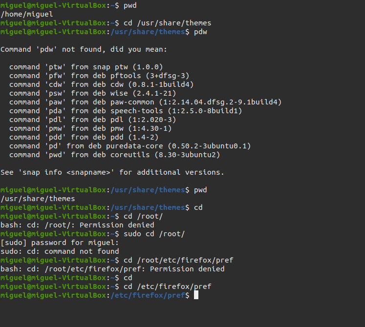

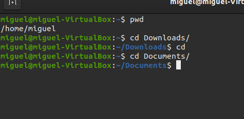

## Question 3

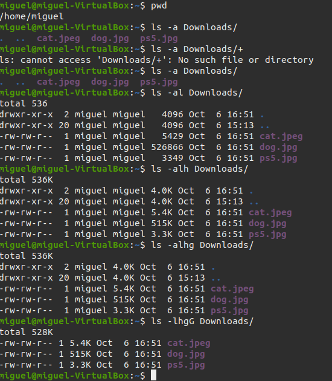

## Question 4

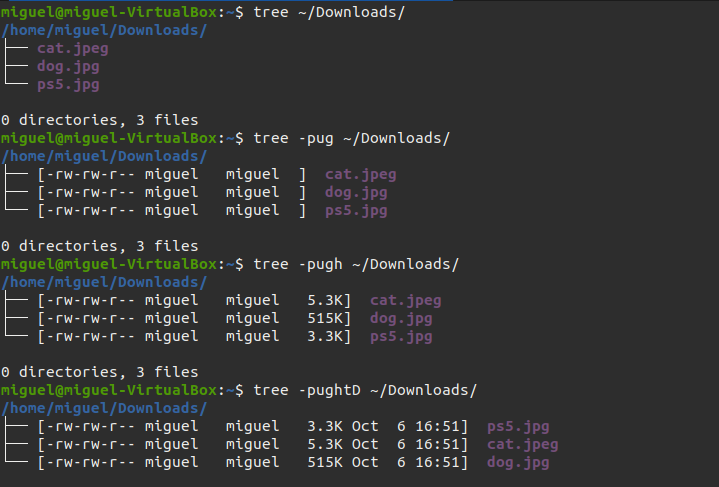

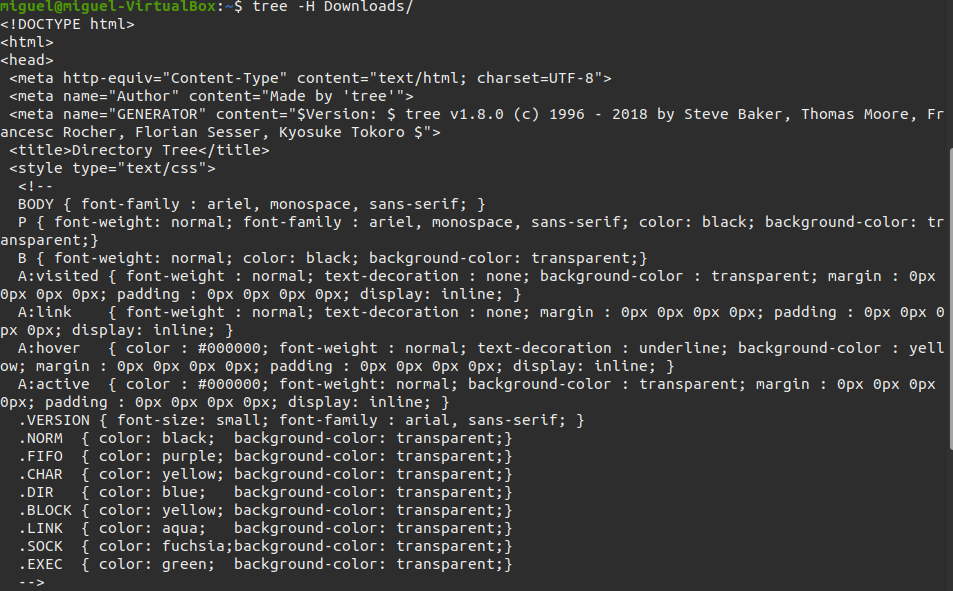

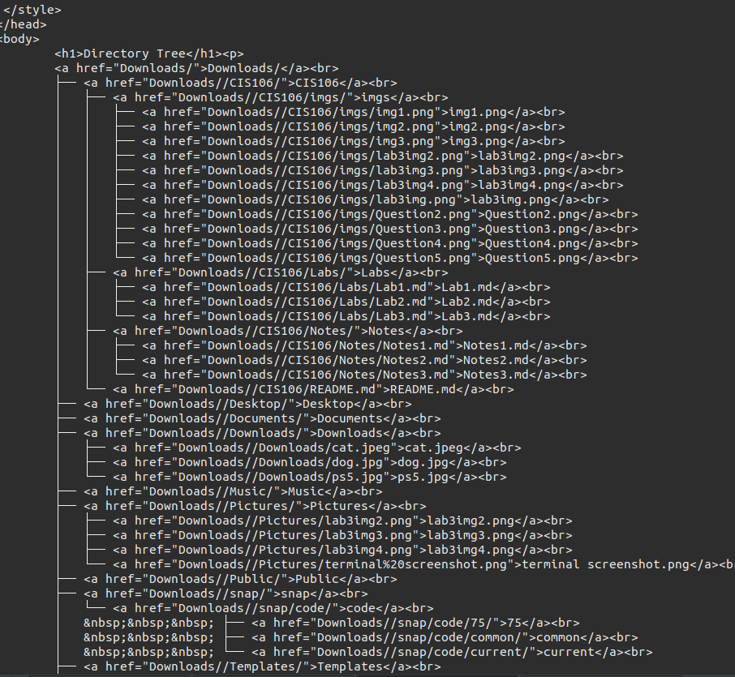

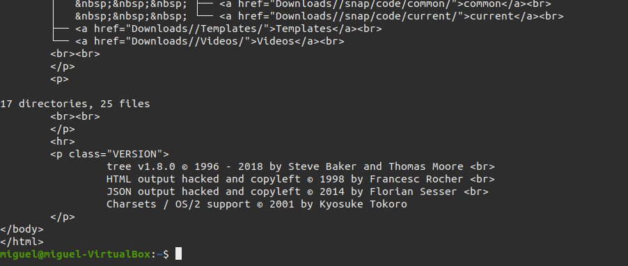

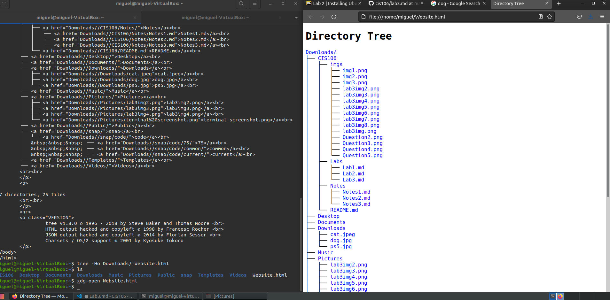

## Question 5

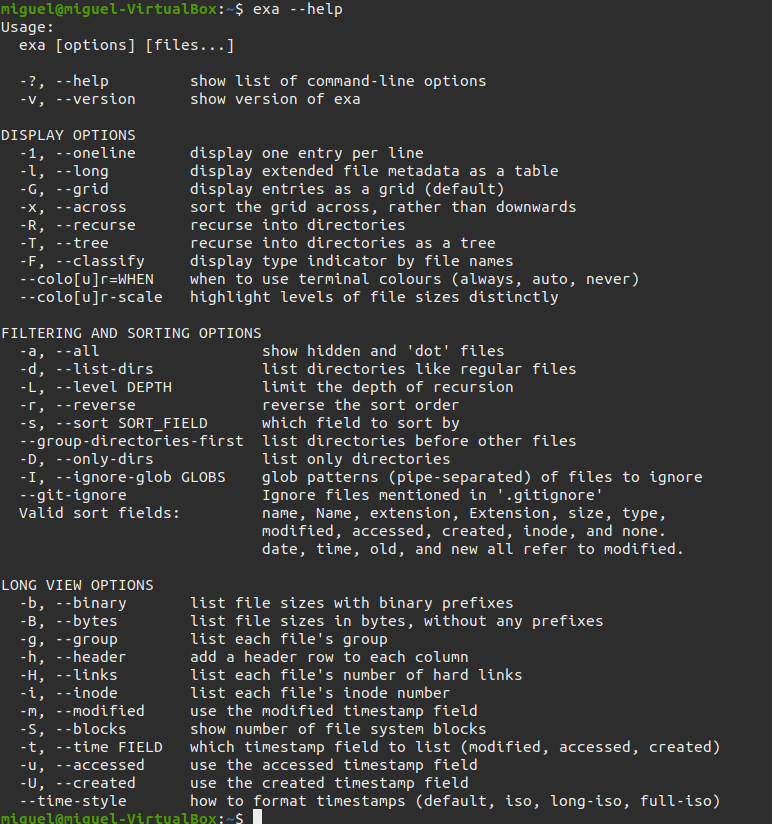

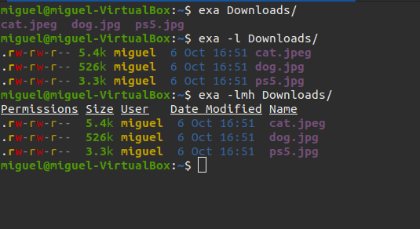