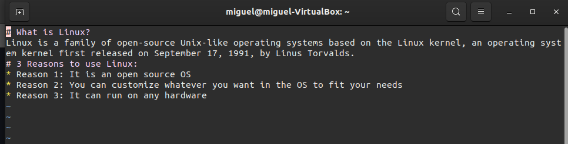
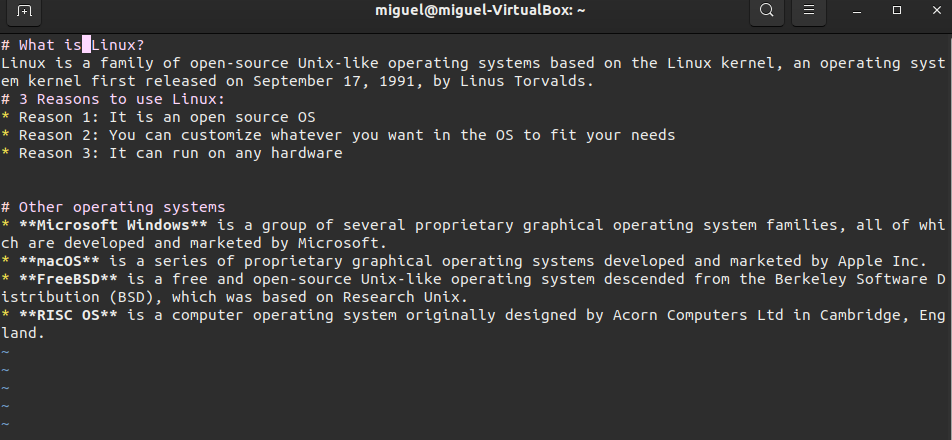
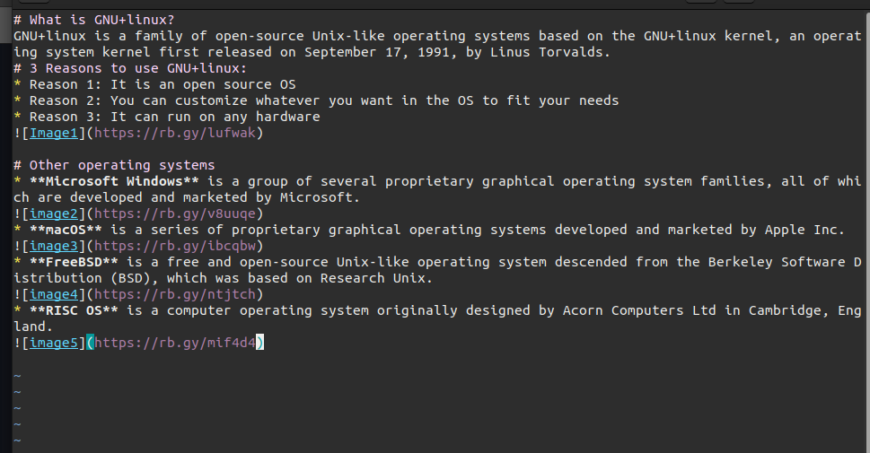

# Lab 6 | Using Vim

## Question 2

[linux.md](https://github.com/MigsMarin/CIS106/blob/main/Labs/linux.md)

[linux+other.md](https://github.com/MigsMarin/CIS106/blob/main/Labs/linux%2Bother.md)

[GNU+Linux.md](https://github.com/MigsMarin/CIS106/blob/main/Labs/GNU%2BLinux.md)
