# Final Notes
- [Final Notes](#final-notes)
- [Lecture 1](#lecture-1)
  - [Intro](#intro)
  - [What is linux?](#what-is-linux)
  - [Linux Architecture](#linux-architecture)
  - [Software licensing agreement](#software-licensing-agreement)
    - [The four essential freedoms](#the-four-essential-freedoms)
    - [Advantages and disadvantages](#advantages-and-disadvantages)
  - [UBUNTU](#ubuntu)
    - [Release cycles](#release-cycles)
  - [Debian](#debian)
    - [GNU/Linux](#gnulinux)
  - [Server-side virtualization](#server-side-virtualization)
  - [Client side virtualization](#client-side-virtualization)
  - [Type 1 VS Type 2 Hypervisor](#type-1-vs-type-2-hypervisor)
    - [Type 1](#type-1)
    - [Type 2](#type-2)
  - [Benefits of Virtualization](#benefits-of-virtualization)
  - [VirtualBox](#virtualbox)
  - [VMWare Workstation Player](#vmware-workstation-player)
  - [Minimal Requirements](#minimal-requirements)
- [Using Virtual Box](#using-virtual-box)
- [What is a Raspberry Pi?](#what-is-a-raspberry-pi)
    - [What do i need?](#what-do-i-need)
    - [Different OSs for the Raspberry Pi](#different-oss-for-the-raspberry-pi)
- [Desktop Environment](#desktop-environment)
- [The GNOME Desktop Environment](#the-gnome-desktop-environment)
- [The KDE Destop Environment](#the-kde-destop-environment)
- [Other Desktop Environments](#other-desktop-environments)
- [The Bash Shell](#the-bash-shell)
  - [Terminal Emulator](#terminal-emulator)
  - [The Bash shell](#the-bash-shell-1)
    - [Shell Prompt](#shell-prompt)
- [How to navigate the filesystem](#how-to-navigate-the-filesystem)
  - [Navigating the FS in the CLI](#navigating-the-fs-in-the-cli)
  - [Listing Files and Directories](#listing-files-and-directories)
  - [Creating files and directories](#creating-files-and-directories)
  - [Deleting files and directories](#deleting-files-and-directories)
  - [Moving and copying files and directories](#moving-and-copying-files-and-directories)
  - [copying files and directories](#copying-files-and-directories)
  - [Working with links](#working-with-links)
    - [hard links](#hard-links)
    - [soft links](#soft-links)
    - [getting help](#getting-help)
  - [Using wildcards](#using-wildcards)
    - [the ? wildcard](#the--wildcard)
    - [the [] wildcard](#the--wildcard-1)
  - [Working with I/O Redirection](#working-with-io-redirection)
  - [Standard file description](#standard-file-description)
  - [Alias](#alias)
- [Basics of VIM](#basics-of-vim)
    - [Saving and quitting](#saving-and-quitting)
    - [Editing](#editing)
    - [Searching words](#searching-words)
  - [Managing user accounts](#managing-user-accounts)
  - [creating a user with useradd](#creating-a-user-with-useradd)
  - [Managing Groups](#managing-groups)
- [Scheduling Tasks](#scheduling-tasks)

# Lecture 1
## Intro
* Almost all devices that work with a computer run on a version of linux
* Its the core of the internet of things
* Powers the cloud
* Many well known companies use linux
## What is linux?
* It is the kernel or the core of an operating system
* Multitasking, multi use, multi purpose operating system
* **largest collaborative project in history**
* Every component from linux is **separate** from the other
* A complete Linux system is called a **Linux Distribution**
* Over 150 Linux Distributions available
* Two main distribution: **Debian and Redhat**
## Linux Architecture
* **Kernel:** Core of the OS that manages everything
* **Daemons:** Programs that run in the background
* **Shells:** Interface that accepts inputs and translates it to the kernel
* **Graphical Desktop Environment:** Software that provides the user a GUI
* **Linux Structure:**
  * Tree structure
  * Files
    * Device files
    * Directory files
    * Binary files
    * Regular files
    * The root is the highest point
## Software licensing agreement
* linux is open source
  * **Open source:** the software may be distributed for a fee or free
  * **Closed Source:** the user is restricted from making modifications to the software
  * Free software: its distributed with the source code
### The four essential freedoms
* **Freedom 0:** Run program as you wish
* **Freedom 1:** Study how the program works and be able to change it at will
* **Freedom 2:** redistribute copies to help others
* **Freedom 3:** redistribute copies of modified versions
### Advantages and disadvantages
* **Advantage**
  * Available for free generally
  * User can modify code
  * More reliable
* **Disadvantages**
  * Risky
  * User friendliness
  * Lack of corporate support
## UBUNTU
* Linux distribution
* Community is built on the Ubuntu Manifesto:
  * Should be free of charge
  * tools should be usable by people in their local language despite disabilities
  * freedom of customization
### Release cycles
* **Regular or non-LTS:** Shipped every 6 months and supported for 9
* **LTS (long-Term Support):** Shipped every two years and supported for 5
* Ubuntu supports a wide variety of desktop and server uses 
* Ubuntu includes major pieces of software
  * Web browser
  * Email client
  * App store
  * Full productivity suite
## Debian
* All volunteer organization for creating free software
* began in 1993 with  Ian Murdock
* Known as the grandfather of all of linux
* Ubuntu was created to be user friendly compared to Debian
### GNU/Linux
* Modelled after Unix
* Designed to be a multi-tasking/user system
* Mainly developed by volunteers
* A combination fo the Linux kernel and the GNU tools
* Development began in 1984# Virtualization - the basics
1. Replicates hardware to simulate inside another machine
2. Two general types:
   * server side
   * client side 
## Server-side virtualization
1. Provides a virtual desktop to each user in the server
   * Thick client or fat client
   * Thin client
   * Zero client 
## Client side virtualization
1. Software installed in the computer
2. Every VM has its own operating system
3. For this kind the computer need:
   * A hypervisor
   * Hardware support
     * capable CPU
     * Enough RAM
     * Enough storage
## Type 1 VS Type 2 Hypervisor
### Type 1
1. Runs on hardware
2. Examples are:
   1. VMware ESX and ESXi
   2. Citrix XenServer
### Type 2
1. Runs on a Host Operating System
2. Examples are:
   1. VMware Workstation Player/Pro
   2. Oracle VirtualBox
## Benefits of Virtualization
1. Can run multiples OSs on one computer
2. Allows apps to be tested before using them 
3. Reduces cost by not needing to buy hardware for a network
4. Offers the chance to test unknown programs without the risk of malware
## VirtualBox
1. Powerful type 2 VM product for home use
2. Open source
3. Runs on:
   1. Windows
   2. Linux
   3. Macintosh
   4. Solaris
4. Supports a large guest OS
## VMWare Workstation Player
1. Free type 2 VM software
2. Free version of workstations with less features
3. Available for Linux and Windows
4. Supports a large number of OSs
## Minimal Requirements
1. AMD V or INTEL V processor
2. Dual core x64 processor with 1.3 GHz or faster
3. 4GB of RAM
4. Enough free space for installing OSs
# Using Virtual Box
1. Extension pack
   1. Base package: consists of all open source components
   2. Extension pack: extends teh functionality of the OVM base package
2. OVM extension packages have a .vbox-extpack file name
# What is a Raspberry Pi?
1. Its a low cost, credit card sized mini computer
2. Capable of doing anything that a normal compute would
   1. The Raspberry Pi foundation is registered as an educational charity
   2. The goal of the foundation is to advance education of adults and children
3. Different types of Raspberry Pi
   1. Raspberry Pi 4
   2. Raspberry Pi 3 
   3. Raspberry Pi Zero W
   4. Raspberry Pi 3 A+
   5. Raspberry Pi 400
### What do i need?
1. Raspberry Pi
2. Case
3. Power supply
4. Micro SD card
5. HDMI Cable
6. everything else is optional
7. Plug and play
### Different OSs for the Raspberry Pi
* Ubuntu
* Kali Linux
* Diet Pi
* Arch Linux
* Elementary OS
* Manjaro
* Windows 10
* Android

1. Very affordable and easy to find
2. You can build your own kit but its not recommended since its more expensive 

# Desktop Environment
1. Before DE there was CLI
   1. there are many graphical desktops in linux
      * GNOME
      * KDE
      * XFCE
      * MATE
      * BUDGIE
      * LXDE
      * Cinnamon
      * Openbox
      * LXQT
      * Pantheon
      * Deeping DE
      * Fluxbox
2. GUI: Graphical interface, like MACOS and Windows
3. DE: environment implemented made oa bundle of programs on top of the OS 
4. On Windows and MACOS the user is limited to one GUI and DE, on linux you can have multiple

# The GNOME Desktop Environment
1. The default desktop in Ubuntu is GNOME 3, its also used by many more distros.
2. GNOME is short for GNU Network Object Model Environment
3. Its part of the GNU project and developed by volunteers and paid contributors
4. started as a free software in August 15, 1997, by Miguel de Icaza and Federico Mena

# The KDE Destop Environment
* The Kool Desktop Environment started in 1996 and it first released in 1998
* KDE had additional software projects and was rebranded as KDE Plasma in 2009
# Other Desktop Environments
* XFCE is a lightweight DE that aims to be fast and using low system resources while still being user friendly and good looking
* started by Oliver Fourdan in 1996
* has a linux flavor called Xubuntu
* The MATE DE is a continuation fo GNOME 2
* has forked apps from the Gnome Core Apps and others have been written from scratch

* Cinnamon is a free and open-source DE for the X window System that comes from GNOME 3 but still follows traditional DE methods
* Cinnamon is the main DE of the Linux Mint distro
* its development started as a response to the release of GNOME 3 and the decision to drop GNOME 2 support
* easy to use with gentle learning curve 
* the LXQT DE is a lightweight Qt DE
* included in most linux and BSD distros
* lightest yet fully functional DE
* DEEPIN DE is the DE of the chinese distro of Deepin
* built on Qt and available for multiple distros
* the devs maintain their own window manager called dde-kwin
* Pantheon DE was created for the Elementary OS
* written from scratch in BALA using GTK 3 and Granite
* Similarities with GNOME shell and MACOS
* the linux answer to MACOS

# The Bash Shell
* Allows large-scale IT possible.
* necessary component for modern computing
* shipped with almost every computer in the world thanks to Brian Fox
* CLI:
  * Command line interface meant to interact with a computer program by using lines of text
  * two ways to access CLI
    * Terminal Emulator
    * Linux Console
* a way to access the CLI is taking the linux system out of a GUI and making it in text mode
* Linux console emulates the old days of hard wired terminals
* when linux starts it creates multiple virtual consoles
* a virtual console is a terminal session that runs in the linux system memory
* most linux distros start with five or six VCs that you can access 
* VCs can be accessed by using a single keystroke combination 
* text mode use the whole screen 
* the number of VCs are displayed with the acronym TTY plus the number
* you can log into the terminal using ID after the login and password
* within the linux VC you don't have the ability to run any graphical programs
* after you have logged in you can keep it active  and be able to switch to a different VC without losing you active session
## Terminal Emulator
* a program that allows the access to the linux CLI. Will be used most of the time if you have a GUI
* some emulators are:
  * GNOME Terminal (included in Ubuntu 20.04)
  * Konsole
  * Terminology
  * RXVT-Unicode
  * TILIX
## The Bash shell
* the GNU bash shell is a program that provides interactive access to the Linux System
* It runs as a regular program and is normally started whenever a user logs into a terminal
* other shells exist:
  * TCSH shell
  * Csh Shell
  * Ksh Shell
  * Zsh Shell
  * Fish Shell

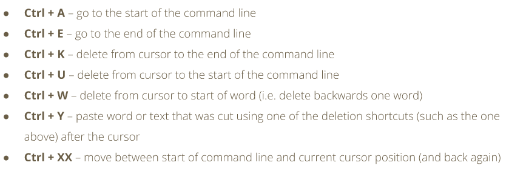

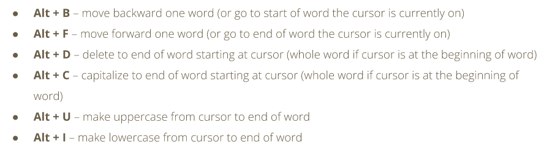

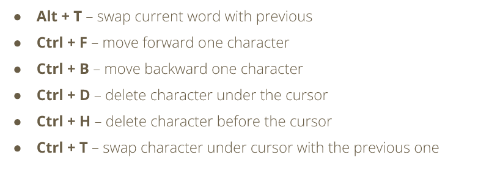

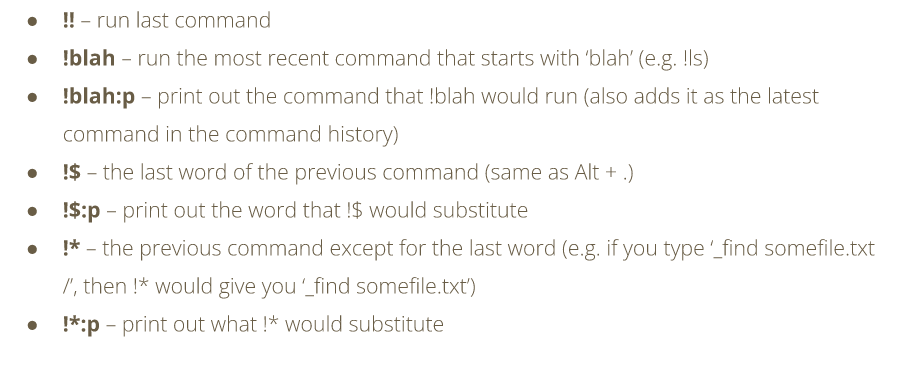

### Shell Prompt
* the shell prompt is what appears when a terminal is launched and the shell is ready to accept input
* can varie in appearance depending on the distro
* if there is a $ instead of a # you have logged in as a superuser (sudo) privilege

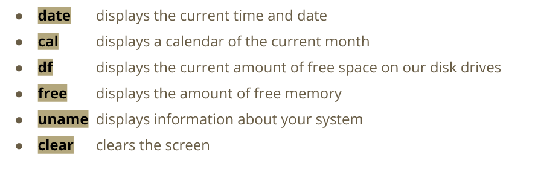

* the shell keeps a log of the commands that you run
* the command history can be accessed with the up and down arrow keys
* commands can be modified
* you can run the history command to see the list of command history
* commands can also be rerun using !

# How to navigate the filesystem

* files are stored to organize and simplify access to data
* linux organizes files in a hierarchical directory structure
* folder and directory are the same thing
* the root is the first directory in the file system
* linux always has a single file system tree
* the nemo file manager uses a GUI

## Navigating the FS in the CLI

* the file system is like a tree where every branch is a directory
* there are parent directories and child directories or subdirectories
* every file has a pathname in the filesystem

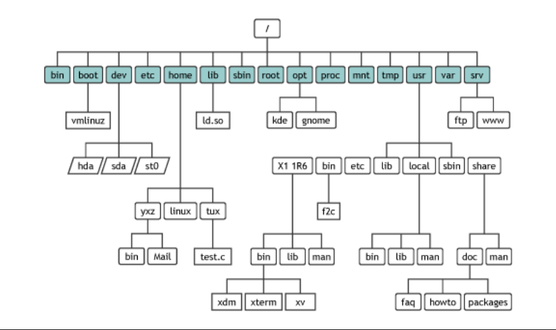

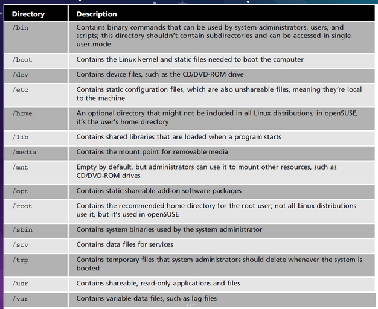

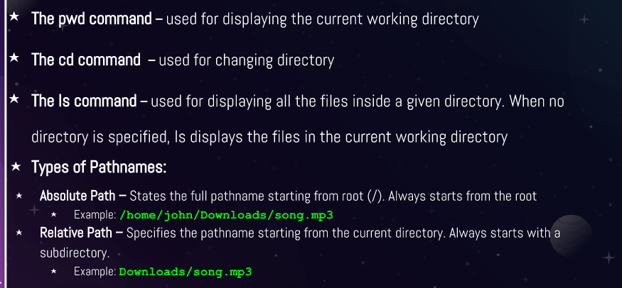

* PWD displays the current working directory
* CD command changes the current working directory
* it can also take you to the home directory

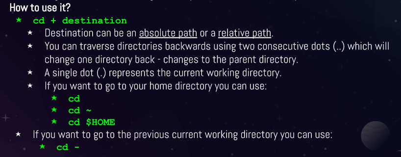

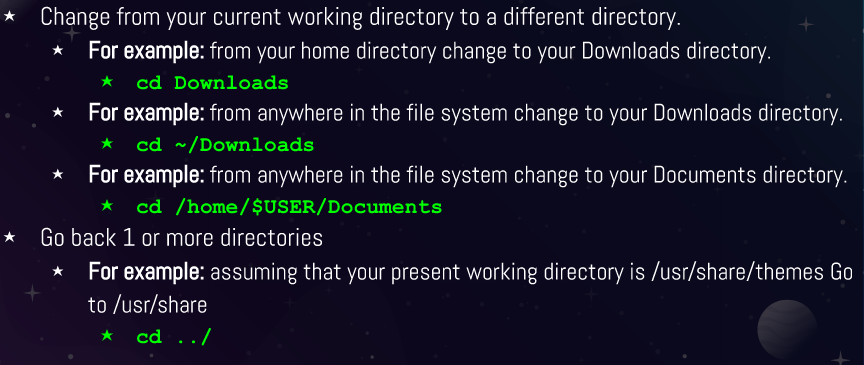

* Tab completes the command
* Arrow keys allow to move, edit and repeat commands
* **Ctrl + a** allows you to go to the start of the command line
* **Ctrl + e** allows you to go to the the end of the command line

## Listing Files and Directories

* LS command is used for listing content in the directory
* can be used with or without arguments
* has many different options and can be seen with the: man Ls command
* sorts alphabetically
* can sort in other ways

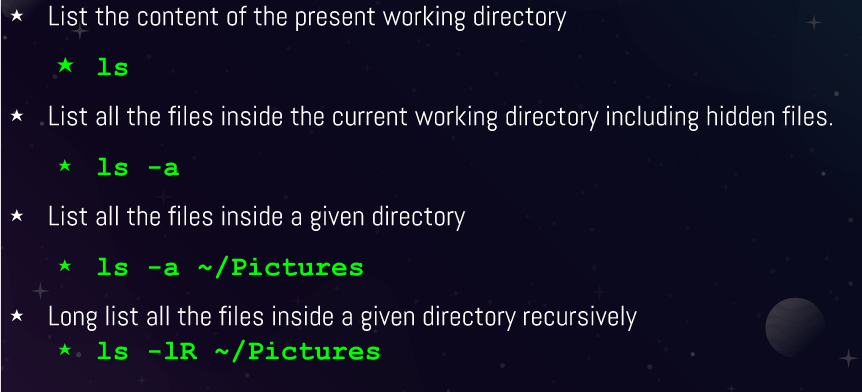

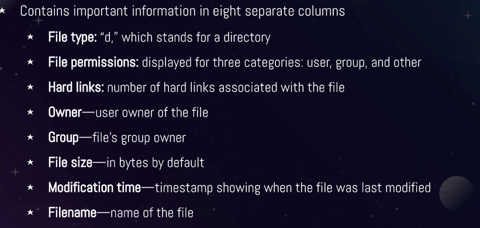

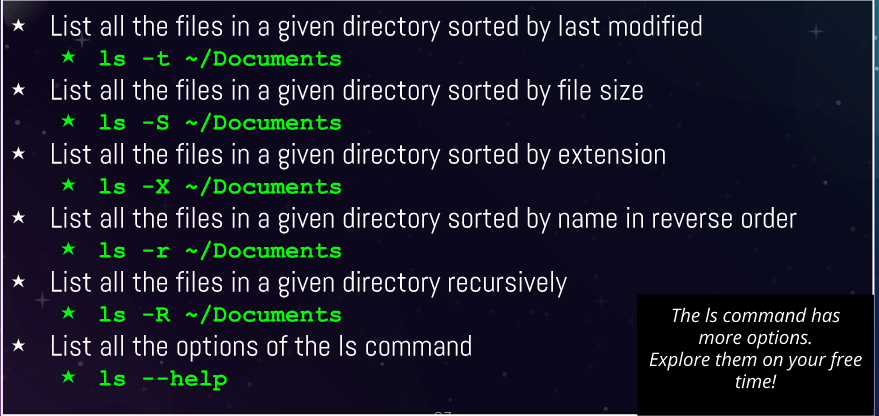

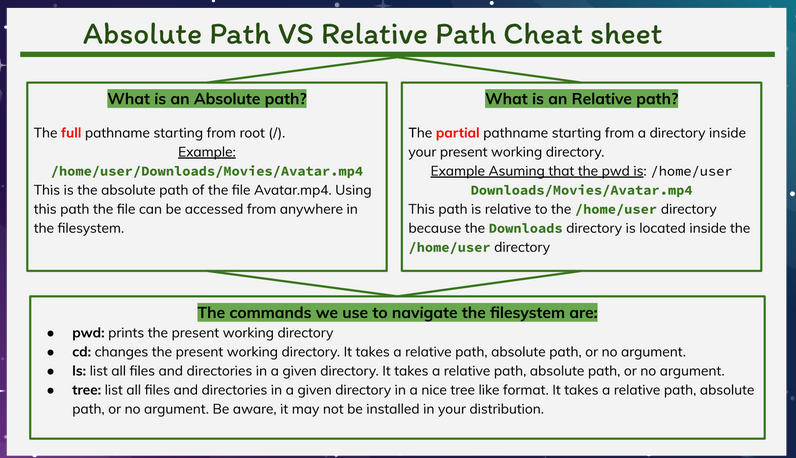

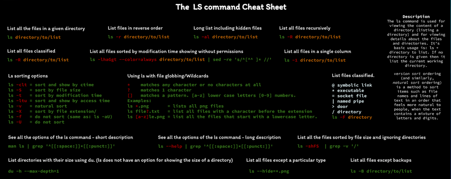# Managing Files and Directories
* Commands are followed by options that modify their behavior
* They are also followed by arguments which are items open which the command acts on

## Creating files and directories
* **mkdir** is used for creating single or multiple directories
* to create one type **mkdir + name of directory**
* separating the name of multiple directories will create them
* it is possible to use absolute path or relative path to create said directories
* it is possible to create a directory with a space in its name by using the (\) or using quotation marks
* creating a directory that already exist will cause an error

Examples of the mkdir command

Creating Files

## Deleting files and directories
* The rm command
  * removes files
  * does not remove directories by default but using **-r** with it will delete directories
  * use **rmdir** to remove empty directories
  * using the **-r** plus the name of the directories or absolute path

## Moving and copying files and directories
* The **mv** command moves and removes directories
* The command is used by using **mv + source + destination**
* To rename a directory the formula is similar **mv + file/directory to rename + new name**
* absolute path and relative path can both be used

## copying files and directories
* **cp** command copies files/directories from a source ot a destination
* the structure of the command is similar to the **mv** command **cp + files to copy + destination**
* to copy directories the **-r** option must be used 

## Working with links

**Inodes**
* an inode is a data structure that contains all the info about a file except its name and content
* every file has an inode
* every inode is identified by a index number 
* the inode table is a database of the location of the data on a partition on linux
* use the **-i** command to view the inodes number
* use the stat command to see the inode data **stat script.sh**

### hard links
* they are files that point to data on the hard drive
* when a file is created it automatically links to the data in the hard drive
* hard links must be created in the same partition 
* data on a hard drive is not eliminated until ever link is deleted
* all hard links are changed once the data on the hard drive is changed
* to create a hard link use **ln file ~/Downloads/fileHL**
### soft links
* **symbolic links (soft links)** are files tha point to other files instead of data 
* soft links do not share the same inode number as hard links
* when the soft link is modified the target file is also modified 
* advantages of soft links is that they can point to files in other partitions
* to create a soft link use **ln -s file fileSL**

### getting help
* the **man** command describe commands, executables, system calls, special files and so forth
* to exit the **man** page press **q**

## Using wildcards
* it represents letters and characters used ot specify a filename for searches
* wildcards are officially called metacharacter wildcards
* the main wildcard is a star, or asterisk
* a star alone matches anything and nothing and matches any number of characters
* an example is **ls *.txt** will match all files that end in .txt regardless of size 

### the ? wildcard
* is is a metacharacter that matches exactly one character
* proves very useful when working with hidden fiels 
* if you want to list all hidden files use **ls .??*.** and it will match all files that start with . or .. and have a character after

### the [] wildcard

# Handling Text Files
* There are a lot of commands for handling text on Linux

* The **Cat** command is used for displaying the content of a file.
* The word **Cat** does not refer to the animal, instead it is short for **concatenate** which means joining two strings together

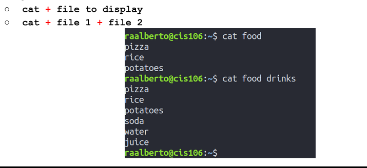

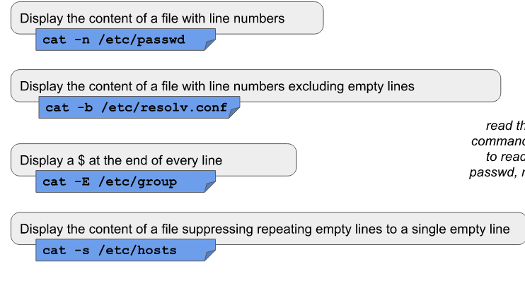

* The **Tac** command is used for displaying the content of a file in reverse
* The command can also cat commands in reverse

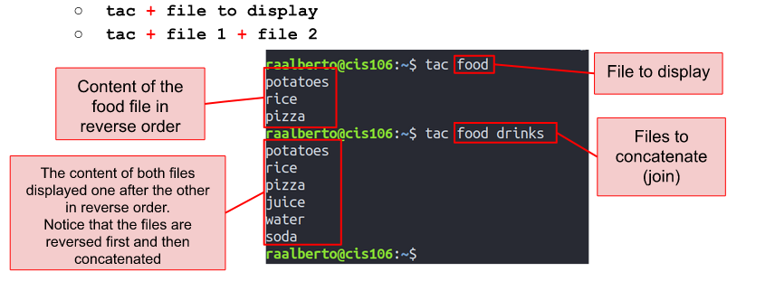

* The **More** command is used for displaying the content of a text file one page at a time

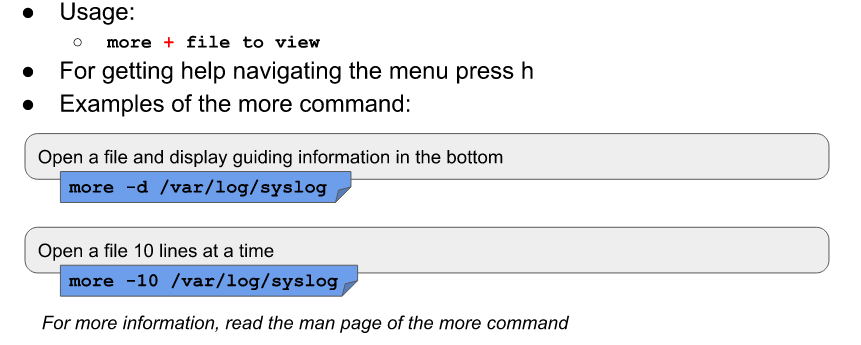

* The **Less** command displays the content of a file 1 page at a time, it helps greatly since when dealing with large files using the command loads 1 page at a time

* The **Head** command displays the top number of lines of a given file. It prints the first 10 lines by default

* The **Tail** command does the same as the **Head** command but backwards. It displays the last 10 lines of a given file

* The **Cut** command is used to extract a section of a file and display it

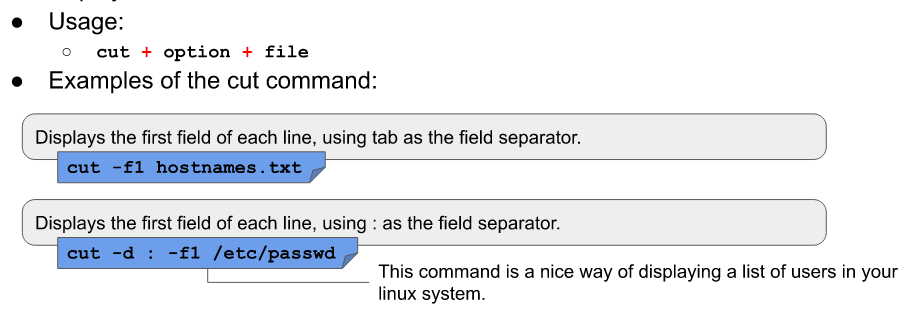

* The **Paste** is used for joining files horizontally in columns

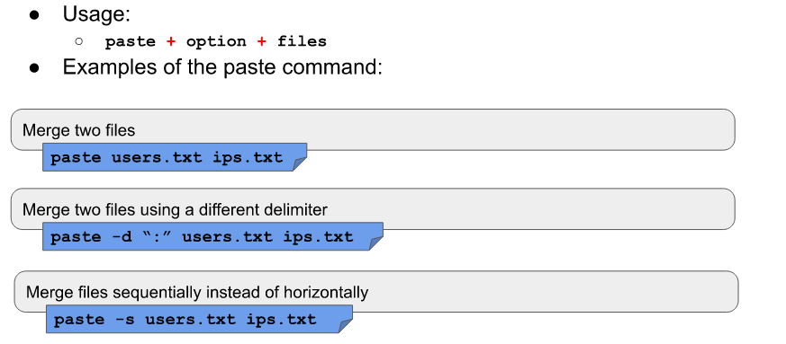

* The **Sort** is used for sorting files as the name implies
* It sorts information in a particular order
* it sorts the contents of a text file line by line and supports other forms of sorting such as 
  * Alphabetically
  * reverser order
  * by number
  * by month
* it can be user for sorting by column number too
* it can be used ignoring case sensitivity
* it can run whatever file is sorted 
* it identifies spaced as a default operator

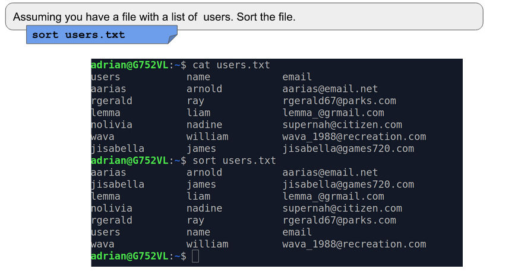

* The **WC** command is used for printing the number of lines, characters and bytes ina a file

* The **TR** command is used for translating or deleting characters from standard output 

* the **Diff** command compared files and displays their differences between them

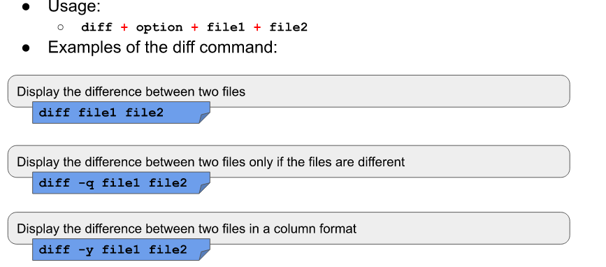 

* The **GREP** command is used to match a string pattern from a file or standard output using a pipe

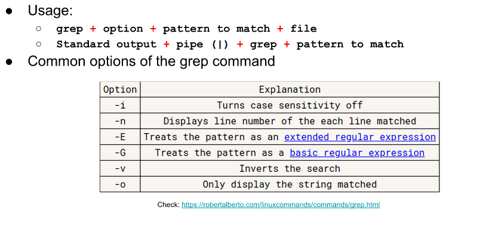 

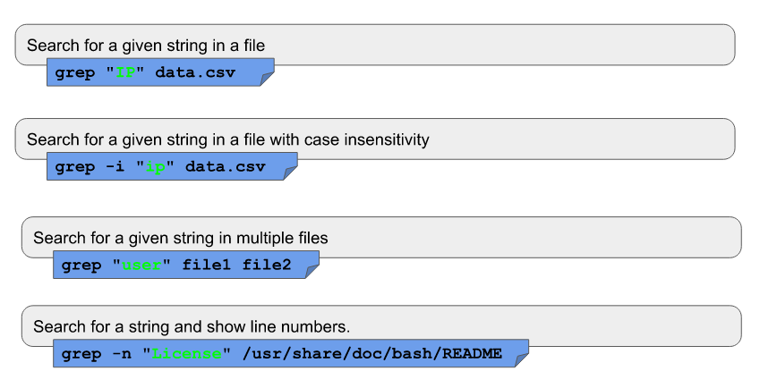 

 

* the **REV** command is sued for reversing the characters position in a given text
* Its used byt typing **rev user.txt**

## Working with I/O Redirection

* Input and output of commands can be riderected to and from files and multiple commands can be used together using pipelines
* since everything in linux is a file, programs sent their output to a file called **SDOUT** and error messages to **STDERR**
* files are linked to the screen by default meaning that they are not saved into a file and are displayed in the terminal
* all input is sent to **STDIN** and is attached to the keyboard in the same way **STDOUT** and **STDERR** are attached to the display by default
* redirection allows users to change where the output goes and where it comes from 

## Standard file description
* file descriptors are positive integers used for identifying open files in a given session 
* 9 files at a time are allowed for each descriptor
* bash reserves the first 3 file descriptors
* they are used for directing the input and output of commands

  

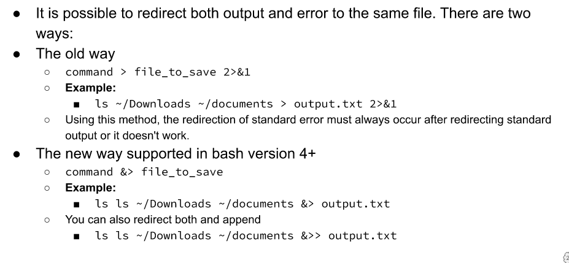 

* In the absence of a filename arguments, cat copies input and output and display it in the terminal

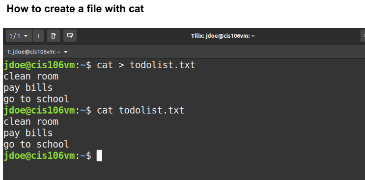 

 

* The pipe **|** allows you to redirect the output of a command to the input of another

## Alias

* alias in linux are shorthands of more complicated commands

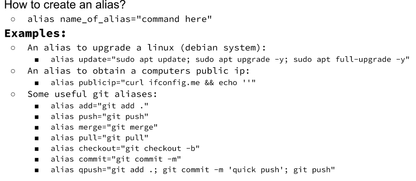

* before creating an alias, it is best to check to see if the words you are choosing is already reserved
* you can use the **type** command to find out if its reserved or not
* if you make an alias to a reserved word, the system may break since the original command will not be used when using the alias
* to make aliases permanent you can place them on either at the end of the **.bashrc** file or in Ubuntu, place it in the **.bash_aliases** located in the home directory
* they are good for remembering difficult commands 
* to remove an alias simply type **unalias *name***
# Basics of VIM
* It is an command-line text editor

* insert mode: its used for writing text
* normal mode: used for manipulating text
* command mode: used to enter vim commands
* visual mode: for navigating and manipulating text selections
* select mode: similar to visual mode
* ex-mode: similar to the command line 

### Saving and quitting 

### Editing 
* using the e command will let you edit another file
* :e new.txt -> will open the file and allow you to edit

### Searching words
* using / and the word will look for the word 
* n will repeat the search for the next word
* ? will search backwards
* *will search the next occurrence of the world under the cursor
* #will search backward 

# Managing Users and Groups
## Managing user accounts
* To add user accounts use useradd or adduser command
* adduser is recommended since its a higher level utility
* to modify a user's info use usermod
* to delete a user use userdel and the -r option is needed for deleting the user and its home directory

## creating a user with useradd

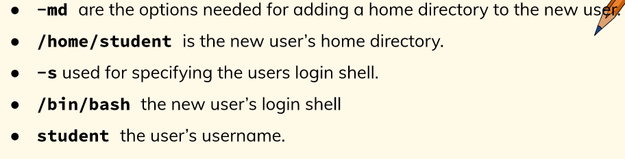

* getent is the utility that is used to view information about a user;s account and password
* useradd does not create a password which is why the passwd utility is used
* passwd + username changes the password

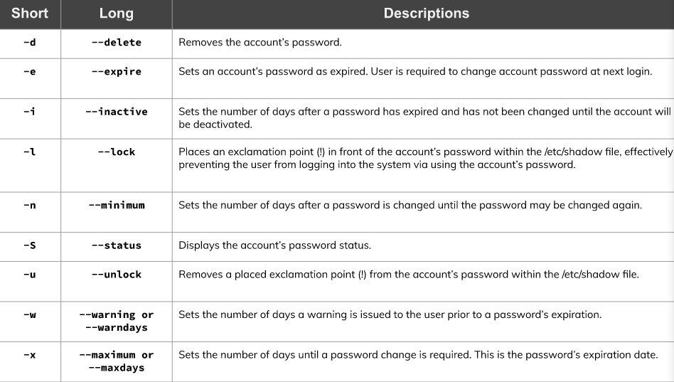

## Managing Groups

# Scheduling Tasks
* the cron program allows the scheduling of tasks to run on any date, time, and week
* its automatically started by the boot scripts
* works by waking up once a minute and checking the crontab file
* it contains the user's list of events that he or she wants executed at a particular date and time
* its a tool that allows you to add entries to the crontab file
* verifies the permissions and then invokes a text editor to edit the files
* It allows amy user in the system to schedule a program to run on any date, at any time, or on a particular day of week