# Desktop Environment
1. Before DE there was CLI
   1. there are many graphical desktops in linux
      * GNOME
      * KDE
      * XFCE
      * MATE
      * BUDGIE
      * LXDE
      * Cinnamon
      * Openbox
      * LXQT
      * Pantheon
      * Deeping DE
      * Fluxbox
2. GUI: Graphical interface, like MACOS and Windows
3. DE: environment implemented made oa bundle of programs on top of the OS 
4. On Windows and MACOS the user is limited to one GUI and DE, on linux you can have multiple

# The GNOME Desktop Environment
1. The default desktop in Ubuntu is GNOME 3, its also used by many more distros.
2. GNOME is short for GNU Network Object Model Environment
3. Its part of the GNU project and developed by volunteers and paid contributors
4. started as a free software in August 15, 1997, by Miguel de Icaza and Federico Mena

# The KDE Destop Environment
* The Kool Desktop Environment started in 1996 and it first released in 1998
* KDE had additional software projects and was rebranded as KDE Plasma in 2009
# Other Desktop Environments
* XFCE is a lightweight DE that aims to be fast and using low system resources while still being user friendly and good looking
* started by Oliver Fourdan in 1996
* has a linux flavor called Xubuntu
* The MATE DE is a continuation fo GNOME 2
* has forked apps from the Gnome Core Apps and others have been written from scratch

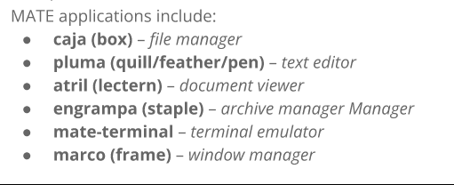

* Cinnamon is a free and open-source DE for the X window System that comes from GNOME 3 but still follows traditional DE methods
* Cinnamon is the main DE of the Linux Mint distro
* its development started as a response to the release of GNOME 3 and the decision to drop GNOME 2 support
* easy to use with gentle learning curve 
* the LXQT DE is a lightweight Qt DE
* included in most linux and BSD distros
* lightest yet fully functional DE
* DEEPIN DE is the DE of the chinese distro of Deepin
* built on Qt and available for multiple distros
* the devs maintain their own window manager called dde-kwin
* Pantheon DE was created for the Elementary OS
* written from scratch in BALA using GTK 3 and Granite
* Similarities with GNOME shell and MACOS
* the linux answer to MACOS

# The Bash Shell
* Allows large-scale IT possible.
* necessary component for modern computing
* shipped with almost every computer in the world thanks to Brian Fox
* CLI:
  * Command line interface meant to interact with a computer program by using lines of text
  * two ways to access CLI
    * Terminal Emulator
    * Linux Console
* a way to access the CLI is taking the linux system out of a GUI and making it in text mode
* Linux console emulates the old days of hard wired terminals
* when linux starts it creates multiple virtual consoles
* a virtual console is a terminal session that runs in the linux system memory
* most linux distros start with five or six VCs that you can access 
* VCs can be accessed by using a single keystroke combination 
* text mode use the whole screen 
* the number of VCs are displayed with the acronym TTY plus the number
* you can log into the terminal using ID after the login and password
* within the linux VC you don't have the ability to run any graphical programs
* after you have logged in you can keep it active  and be able to switch to a different VC without losing you active session
## Terminal Emulator
* a program that allows the access to the linux CLI. Will be used most of the time if you have a GUI
* some emulators are:
  * GNOME Terminal (included in Ubuntu 20.04)
  * Konsole
  * Terminology
  * RXVT-Unicode
  * TILIX
## The Bash shell
* the GNU bash shell is a program that provides interactive access to the Linux System
* It runs as a regular program and is normally started whenever a user logs into a terminal
* other shells exist:
  * TCSH shell
  * Csh Shell
  * Ksh Shell
  * Zsh Shell
  * Fish Shell

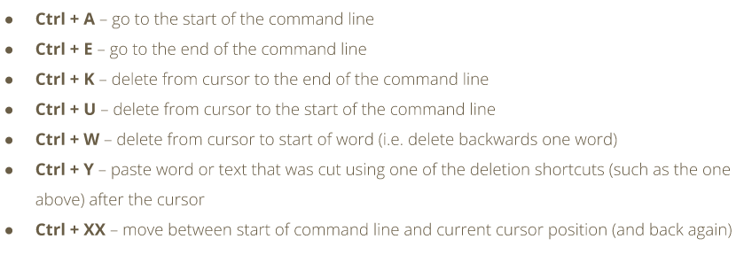

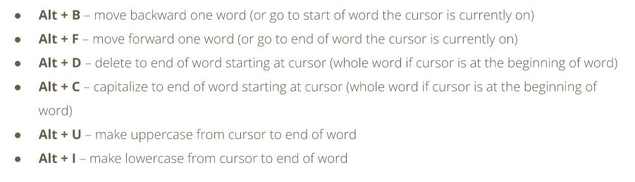

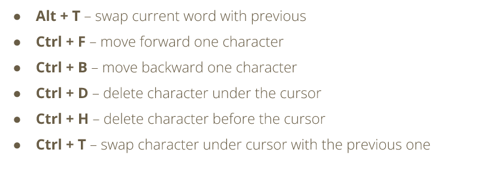

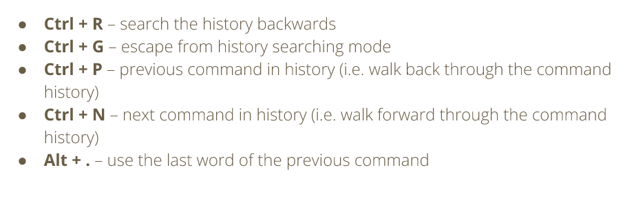

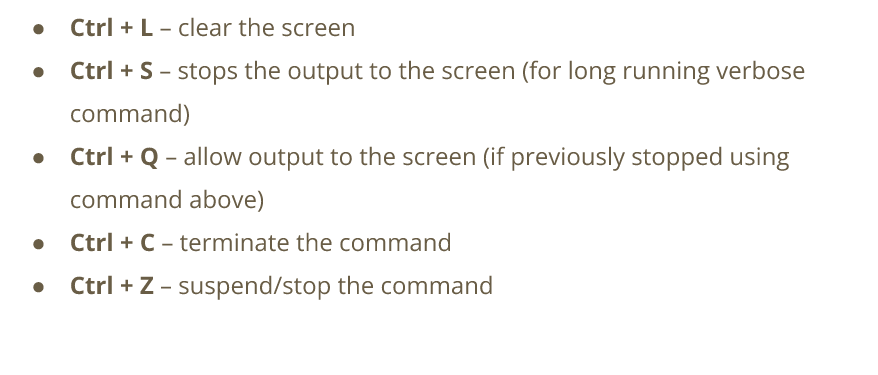

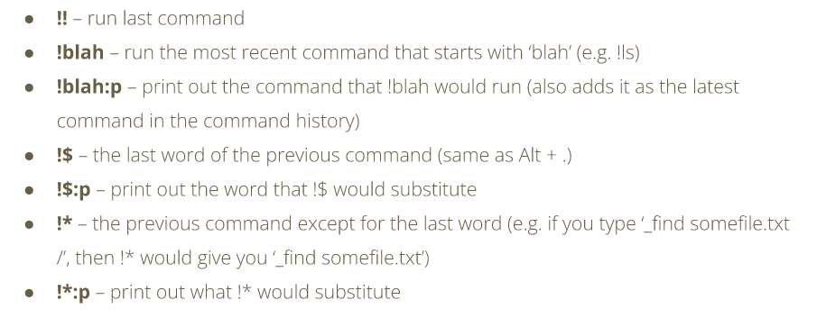

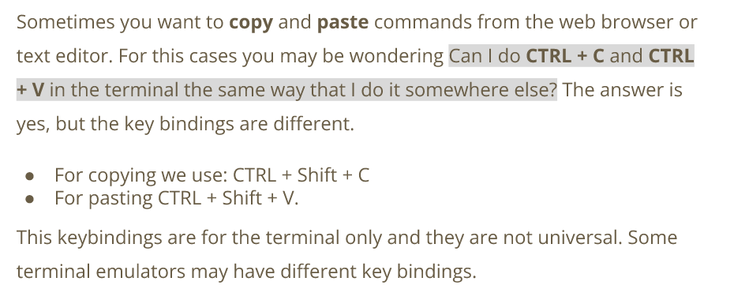

### Shell Prompt
* the shell prompt is what appears when a terminal is launched and the shell is ready to accept input
* can varie in appearance depending on the distro
* if there is a $ instead of a # you have logged in as a superuser (sudo) privilege

* the shell keeps a log of the commands that you run
* the command history can be accessed with the up and down arrow keys
* commands can be modified
* you can run the history command to see the list of command history
* commands can also be rerun using !

# How to navigate the filesystem

* files are stored to organize and simplify access to data
* linux organizes files in a hierarchical directory structure
* folder and directory are the same thing
* the root is the first directory in the file system
* linux always has a single file system tree
* the nemo file manager uses a GUI

## Navigating the FS in the CLI

* the file system is like a tree where every branch is a directory
* there are parent directories and child directories or subdirectories
* every file has a pathname in the filesystem

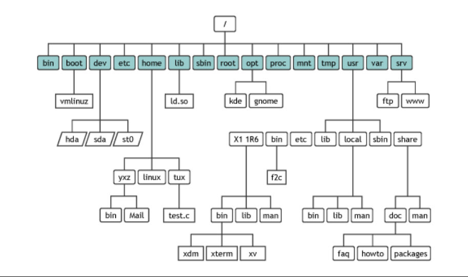

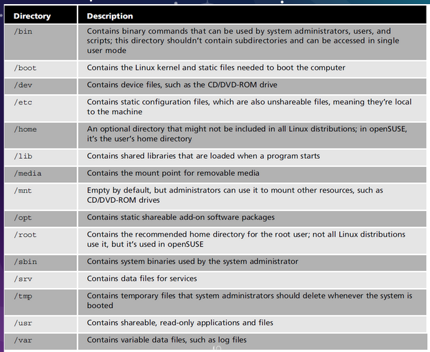

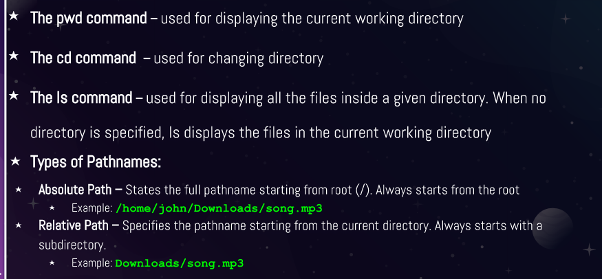

* PWD displays the current working directory
* CD command changes the current working directory
* it can also take you to the home directory

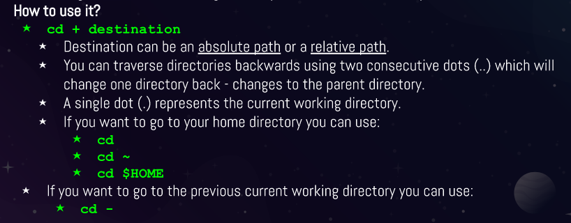

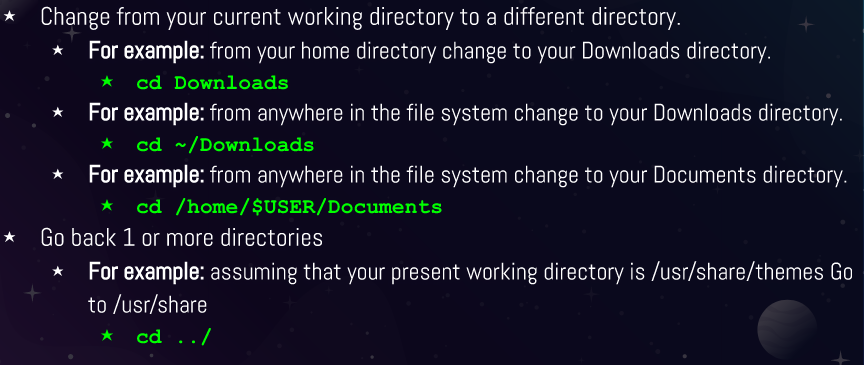

* Tab completes the command
* Arrow keys allow to move, edit and repeat commands
* **Ctrl + a** allows you to go to the start of the command line
* **Ctrl + e** allows you to go to the the end of the command line

## Listing Files and Directories

* LS command is used for listing content in the directory
* can be used with or without arguments
* has many different options and can be seen with the: man Ls command
* sorts alphabetically
* can sort in other ways

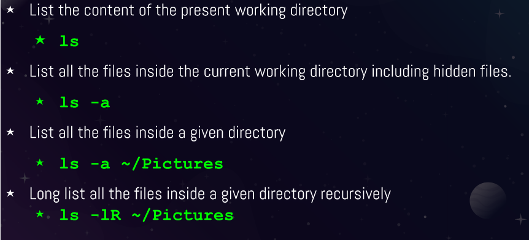

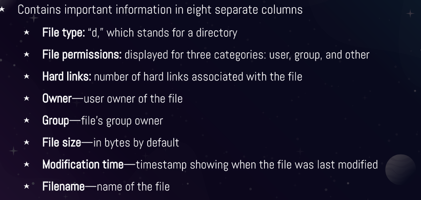

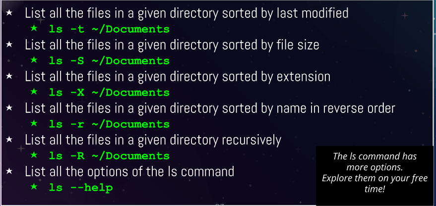

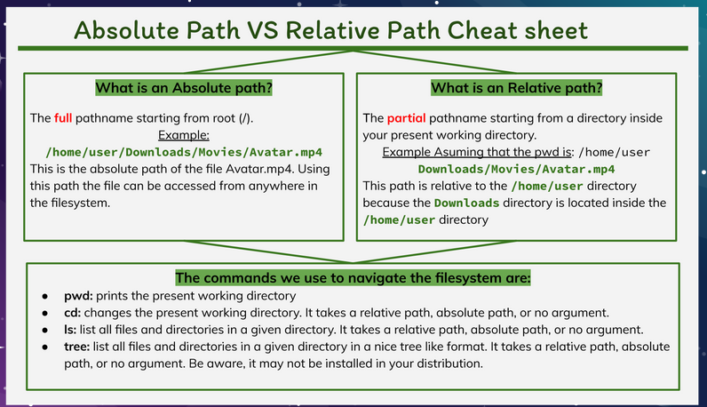

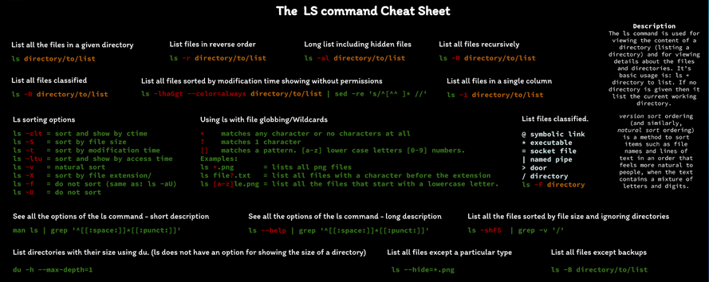