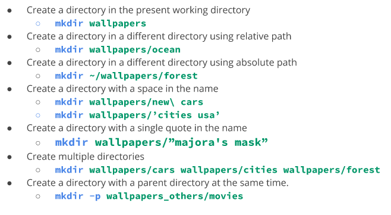
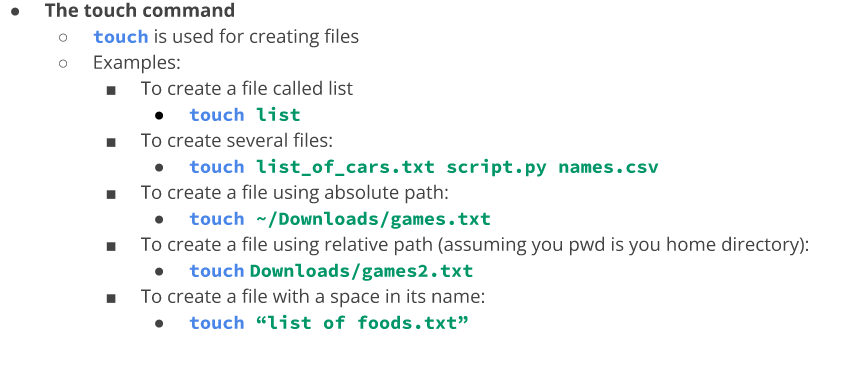
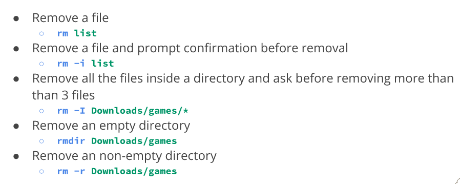
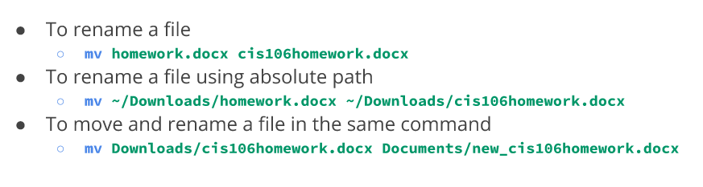
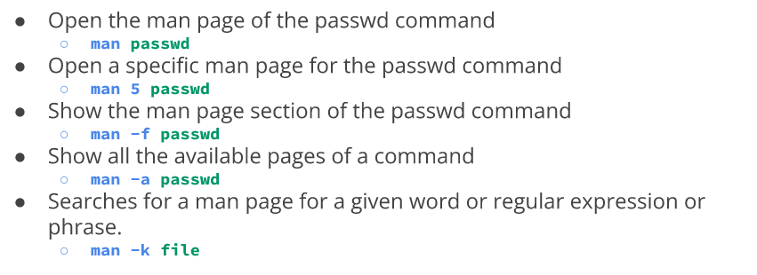
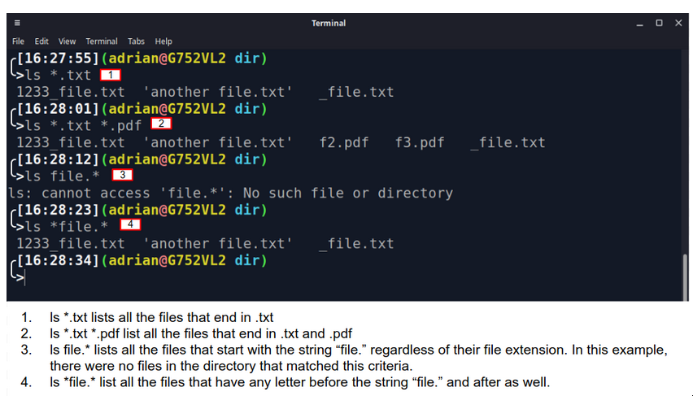
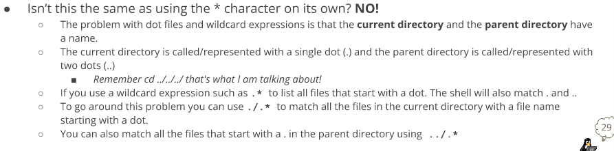
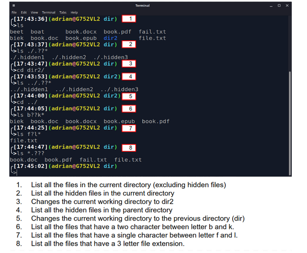
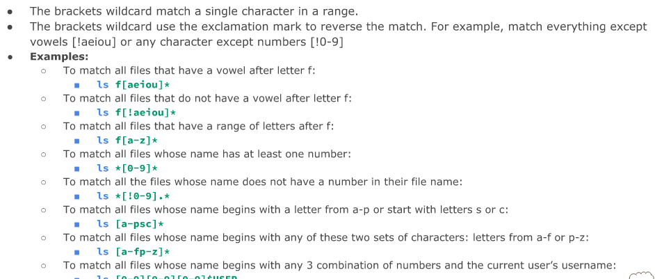
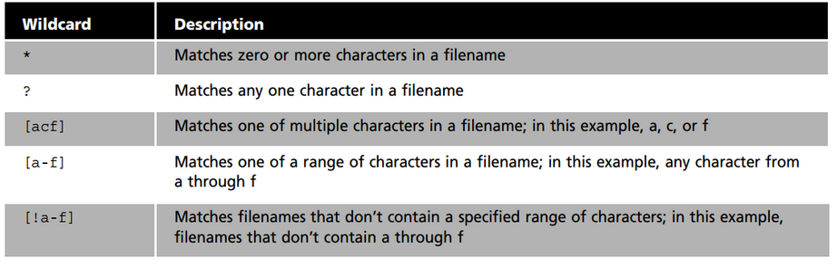

# Managing Files and Directories
* Commands are followed by options that modify their behavior
* They are also followed by arguments which are items open which the command acts on

## Creating files and directories
* **mkdir** is used for creating single or multiple directories
* to create one type **mkdir + name of directory**
* separating the name of multiple directories will create them
* it is possible to use absolute path or relative path to create said directories
* it is possible to create a directory with a space in its name by using the (\) or using quotation marks
* creating a directory that already exist will cause an error

Examples of the mkdir command

Creating Files

## Deleting files and directories
* The rm command
  * removes files
  * does not remove directories by default but using **-r** with it will delete directories
  * use **rmdir** to remove empty directories
  * using the **-r** plus the name of the directories or absolute path

## Moving and copying files and directories
* The **mv** command moves and removes directories
* The command is used by using **mv + source + destination**
* To rename a directory the formula is similar **mv + file/directory to rename + new name**
* absolute path and relative path can both be used

## copying files and directories
* **cp** command copies files/directories from a source ot a destination
* the structure of the command is similar to the **mv** command **cp + files to copy + destination**
* to copy directories the **-r** option must be used 

## Working with links

**Inodes**
* an inode is a data structure that contains all the info about a file except its name and content
* every file has an inode
* every inode is identified by a index number 
* the inode table is a database of the location of the data on a partition on linux
* use the **-i** command to view the inodes number
* use the stat command to see the inode data **stat script.sh**

### hard links
* they are files that point to data on the hard drive
* when a file is created it automatically links to the data in the hard drive
* hard links must be created in the same partition 
* data on a hard drive is not eliminated until ever link is deleted
* all hard links are changed once the data on the hard drive is changed
* to create a hard link use **ln file ~/Downloads/fileHL**
### soft links
* **symbolic links (soft links)** are files tha point to other files instead of data 
* soft links do not share the same inode number as hard links
* when the soft link is modified the target file is also modified 
* advantages of soft links is that they can point to files in other partitions
* to create a soft link use **ln -s file fileSL**

### getting help
* the **man** command describe commands, executables, system calls, special files and so forth
* to exit the **man** page press **q**

## Using wildcards
* it represents letters and characters used ot specify a filename for searches
* wildcards are officially called metacharacter wildcards
* the main wildcard is a star, or asterisk
* a star alone matches anything and nothing and matches any number of characters
* an example is **ls *.txt** will match all files that end in .txt regardless of size 

### the ? wildcard
* is is a metacharacter that matches exactly one character
* proves very useful when working with hidden fiels 
* if you want to list all hidden files use **ls .??*.** and it will match all files that start with . or .. and have a character after

### the [] wildcard

