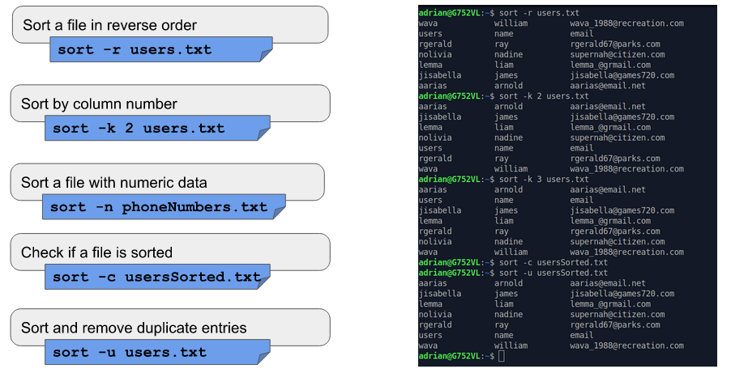
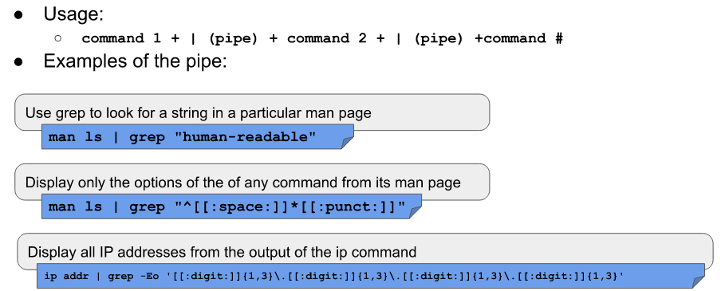

# Handling Text Files
* There are a lot of commands for handling text on Linux

* The **Cat** command is used for displaying the content of a file.
* The word **Cat** does not refer to the animal, instead it is short for **concatenate** which means joining two strings together

* The **Tac** command is used for displaying the content of a file in reverse
* The command can also cat commands in reverse

* The **More** command is used for displaying the content of a text file one page at a time

* The **Less** command displays the content of a file 1 page at a time, it helps greatly since when dealing with large files using the command loads 1 page at a time

* The **Head** command displays the top number of lines of a given file. It prints the first 10 lines by default

* The **Tail** command does the same as the **Head** command but backwards. It displays the last 10 lines of a given file

* The **Cut** command is used to extract a section of a file and display it

* The **Paste** is used for joining files horizontally in columns

* The **Sort** is used for sorting files as the name implies
* It sorts information in a particular order
* it sorts the contents of a text file line by line and supports other forms of sorting such as 
  * Alphabetically
  * reverser order
  * by number
  * by month
* it can be user for sorting by column number too
* it can be used ignoring case sensitivity
* it can run whatever file is sorted 
* it identifies spaced as a default operator

* The **WC** command is used for printing the number of lines, characters and bytes ina a file

* The **TR** command is used for translating or deleting characters from standard output 

* the **Diff** command compared files and displays their differences between them

 

* The **GREP** command is used to match a string pattern from a file or standard output using a pipe

 

 

 

* the **REV** command is sued for reversing the characters position in a given text
* Its used byt typing **rev user.txt**

## Working with I/O Redirection

* Input and output of commands can be riderected to and from files and multiple commands can be used together using pipelines
* since everything in linux is a file, programs sent their output to a file called **SDOUT** and error messages to **STDERR**
* files are linked to the screen by default meaning that they are not saved into a file and are displayed in the terminal
* all input is sent to **STDIN** and is attached to the keyboard in the same way **STDOUT** and **STDERR** are attached to the display by default
* redirection allows users to change where the output goes and where it comes from 

## Standard file description
* file descriptors are positive integers used for identifying open files in a given session 
* 9 files at a time are allowed for each descriptor
* bash reserves the first 3 file descriptors
* they are used for directing the input and output of commands

  

 

* In the absence of a filename arguments, cat copies input and output and display it in the terminal

 

 

* The pipe **|** allows you to redirect the output of a command to the input of another

## Alias

* alias in linux are shorthands of more complicated commands

* before creating an alias, it is best to check to see if the words you are choosing is already reserved
* you can use the **type** command to find out if its reserved or not
* if you make an alias to a reserved word, the system may break since the original command will not be used when using the alias
* to make aliases permanent you can place them on either at the end of the **.bashrc** file or in Ubuntu, place it in the **.bash_aliases** located in the home directory
* they are good for remembering difficult commands 
* to remove an alias simply type **unalias *name***
