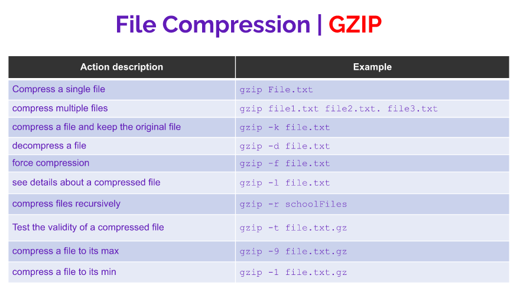

# Managing Data
* backup: copies files and directories to an archive
* system backup: ise to restore data in case of a system failure or data loss and corruption
* archive: file containing many other files, each of which is still identified by its filename, owner, permissions, and timestamp
* tar: creates archives by combining giles and directories into a single file
* CPIO: creates an archive, restores files from an archive, or copies into a directory
* AR: create, modifies, and extracts from archives 

## File compression and decompression

#### GZIP bzip2 and xz

#### cip 7zip and rar

