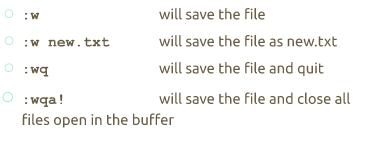
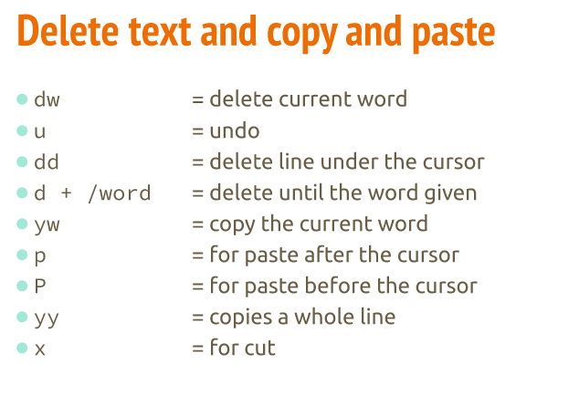
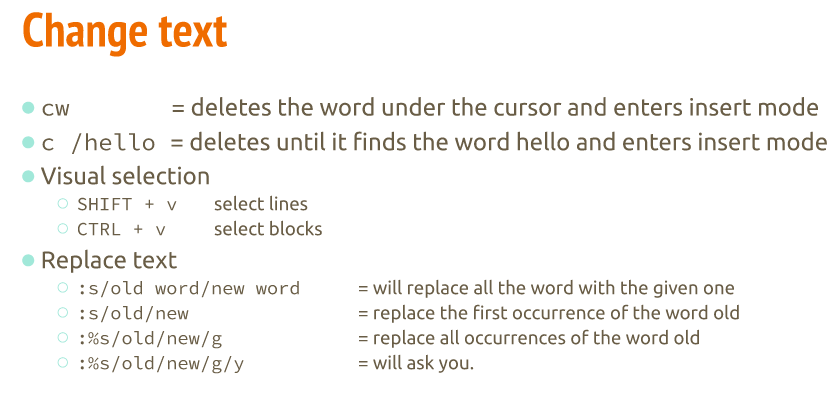
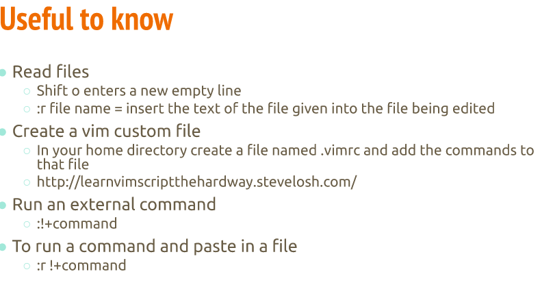

# Basics of VIM
* It is an command-line text editor

* insert mode: its used for writing text
* normal mode: used for manipulating text
* command mode: used to enter vim commands
* visual mode: for navigating and manipulating text selections
* select mode: similar to visual mode
* ex-mode: similar to the command line 

### Saving and quitting 

### Editing 
* using the e command will let you edit another file
* :e new.txt -> will open the file and allow you to edit

### Searching words
* using / and the word will look for the word 
* n will repeat the search for the next word
* ? will search backwards
* *will search the next occurrence of the world under the cursor
* #will search backward 

