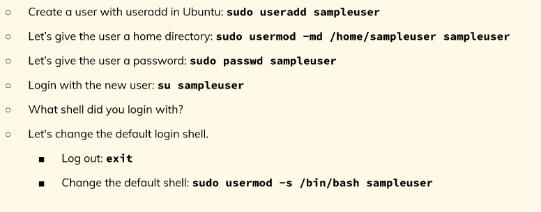
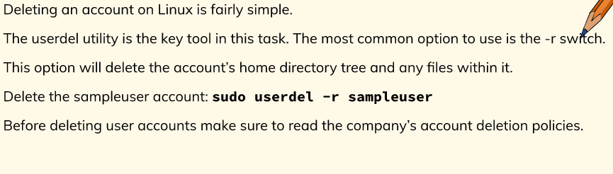
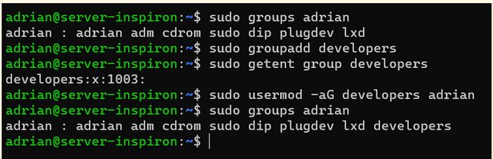

# Managing Users and Groups
## Managing user accounts
* To add user accounts use useradd or adduser command
* adduser is recommended since its a higher level utility
* to modify a user's info use usermod
* to delete a user use userdel and the -r option is needed for deleting the user and its home directory

## creating a user with useradd

* getent is the utility that is used to view information about a user;s account and password
* useradd does not create a password which is why the passwd utility is used
* passwd + username changes the password

## Managing Groups

